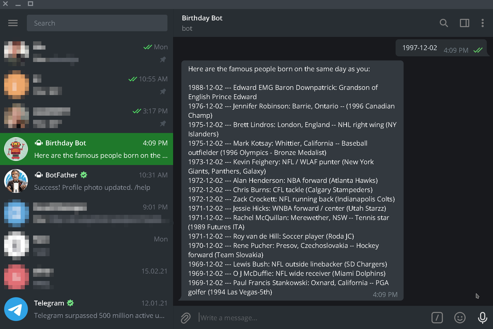

# RUBY CAPSTONE PROJECT: TELEGRAM BOT

I was asked to create a Telegram bot. For this project I have used couple gems and 
hiztory.org API. The Bot waits for user's birth-date input and than checks if its valid date and if so it fetches the data from the external API. This data consists of famous people born on the same month/day. All this information is returned to the user as a Telegram message.

## Built With
- Ruby
- Gems: telegram-bot-ruby, libxml-ruby, net-http-persistent

## Getting Started
To get a local copy up and running follow these simple example steps:

1. Clone the repository as indicated by Setup section below
2.  In the local directory in which this repository is cloned, enter in the terminal or text-editor console: 

-  Rrun bundle to install all the dependancies:
> `` bundle install ``

- Then run this:
> `` ruby bin/main.rb `` 

- This will start the bot in your console. It will print 'Bot is running in the background...' to indicate that it is running.

### Prerequisites
- Text editor (ie VSCode)
- GitHub
- Git

### Rspec
- To run the tests in the 'main_spec.rb' file run 'rspec' in the terminal from within project root.

### Setup
Clone repository from github to your local drive by following these steps:
- Go to the main page of the repository
- Above the listed files, click the green Code button
- You can clone the repository using:
  - GitHub CLI:
  >``gh repo clone zilton7/telegram-bot.git ``
  - SSH:
  >`` git clone git@github.com:zilton7/telegram-bot.git ``
  - HTTPS:
  > `` git clone https://github.com/zilton7/telegram-bot.git ``

- Open Terminal
- Change the current working directory to the location you want the cloned directory
  > `` cd ~/path_to/location ``
- Type one of the git clone commands listed above.
- Press Enter to create your local clone

### Install
- Install VSCode or any text editor of your choice, to view the code on your local machine.
- Install Git.

### Usage
1. To use this bot in your Telegram app, please search and start conversation with
>`` @z_bday_bot ``

2. Type your birthday date to receive the list of famous people born on the same month and day
>`` 1997-12-02 ``

## AUTHOR

ZIL NORVILIS

- GitHub: [@zilton7](https://github.com/zilton7)
- Twitter: [@devnor7](https://twitter.com/devnor7)
- LinkedIn: [zil-norvilis](https://www.linkedin.com/in/zil-norvilis)

## Contributing

Contributions, issues, and feature requests are welcome!

Feel free to check the [issues page](https://github.com/zilton7/telegram-bot/issues).

## Show your support

Give a ⭐️ if you like this project!

## Acknowledgments

- Hat tip to anyone whose code was used
- Inspiration
- etc

## License

- This project is [MIT](https://opensource.org/licenses/MIT) licensed.
- This project is [creativecommons](https://creativecommons.org/licenses/by-nc/4.0/) licensed.
